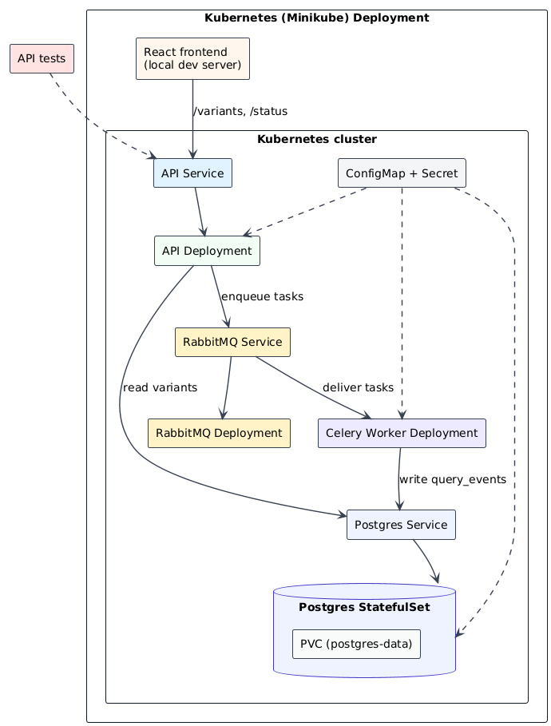
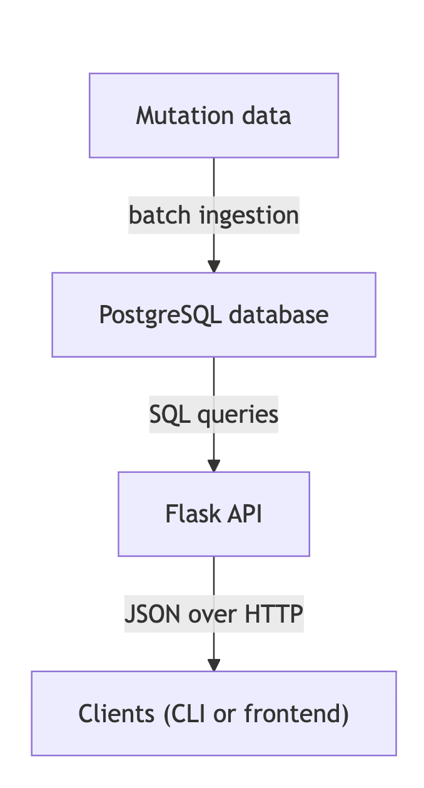

# Mutation Browser

Mutation Browser is a full-stack web application for storing, querying, and
interactively exploring structured genomic mutation data. The system combines
a relational database, a backend web API, a browser-based user interface, and
asynchronous query logging, with deployment options via Docker Compose or
Kubernetes (Minikube).

It is designed to demonstrate a clean, modular architecture for data ingestion,
persistence, asynchronous processing, and downstream consumption.

## Table of contents

- [Tech Stack](#tech-stack)
- [Overview](#overview)
- [Architecture](#architecture)
- [Project structure](#project-structure)
- [Database schema](#database-schema)
- [API endpoints](#api-endpoints)
- [User interface](#user-interface)
- [Running the system locally](#running-the-system-locally)
- [Run with Minikube (Kubernetes)](#run-with-minikube-kubernetes)
- [Async Request Flow (Query Logging)](#async-request-flow-query-logging)

## Tech Stack

- **Frontend:** React, Vite
- **Backend:** Python, Flask, Flask-CORS, Gunicorn, Celery
- **Database:** PostgreSQL
- **Data Access:** psycopg2 (PostgreSQL driver)
- **Infra/DevOps:** Docker, Docker Compose, RabbitMQ, Kubernetes (Minikube)
- **Architecture:** React frontend + Flask REST API + PostgreSQL database + async logging with Celery/RabbitMQ

---

## Overview

The Mutation Browser system provides:

- A PostgreSQL-backed data model for mutation records
- A batch ingestion mechanism for loading mutation data into the database
- A Flask-based web API for querying mutations
- A React-based frontend for interactive exploration
- Asynchronous logging of query events using Celery and RabbitMQ
- Background worker for audit and analytics tasks
- Containerized deployment using Docker and Docker Compose
- Local Kubernetes deployment using Minikube and Kubernetes manifests

The architecture cleanly separates data storage, application logic, and
presentation, and is suitable for local development as well as cloud deployment.

---

## Architecture

- Mutation records are stored in a PostgreSQL database.
- A Flask API queries the database using parameterized SQL.
- A React frontend consumes API responses over HTTP.
- A Celery worker consumes query-log tasks from RabbitMQ and writes to PostgreSQL.
- Services are orchestrated locally using Docker Compose.
- Kubernetes manifests mirror the Compose services for local orchestration.

This diagram illustrates the Kubernetes (Minikube) deployment view, showing
services, deployments, and the worker/broker flow.

This diagram illustrates the flow of mutation data from ingestion through
persistent storage and into a stateless web API, which is then consumed by a
browser-based client.

---

## Project structure

- `backend/`  
  Flask web service implementing the API layer

- `backend/celery_app.py`  
  Celery app configuration and async task definitions

- `frontend/`  
  React application providing an interactive user interface

- `db/`  
  Database schema definitions

- `data/`  
  Data preparation and ingestion utilities

- `scripts/`  
  Operational and maintenance scripts

- `docker/`  
  Containerization documentation and assets

- `k8s/`  
  Kubernetes manifests for local Minikube deployment
---

## Database schema

The database contains tables for mutation records and query logging:

**variants**
- `sample_id`
- `gene`
- `variant`
- `vaf`
- `tumor_type`

**query_events**
- `request_id`
- `gene`
- `requested_at`
- `status`

The schema is defined in `db/schema.sql`.

---

## API endpoints

- `GET /health`  
  Health check endpoint

- `GET /variants?gene=<GENE>`  
  Returns mutation records for the specified gene and a request ID

- `GET /status/<REQUEST_ID>`  
  Returns the async query-log status for a request ID

---

## User interface

The frontend provides a browser-based interface for querying mutation records
by gene name and inspecting results in tabular form, including a count of
matching samples.

The frontend communicates directly with the backend API and demonstrates
end-to-end data flow from database to user-facing application.

---

## Running the system locally

The backend API and database are run using Docker Compose, while the frontend
is served via a local development server.

At a high level:
1. Start backend services (API + Postgres + RabbitMQ + Celery):
   - `docker compose up -d`
2. Start the frontend dev server:
   - `cd frontend && npm run dev`
3. Open the app:
   - Frontend: http://localhost:5173
   - API: http://localhost:8000/health

Detailed run instructions are provided in the respective component directories.

---

## Run with Minikube (Kubernetes)

Prerequisites:
- `brew install kubectl minikube`
- `kubectl version --client`
- `minikube version`

Steps:
1. Stop Docker Compose (if running):
   - `docker compose down`
2. Start Minikube (Docker driver):
   - `minikube start --driver=docker`
3. Point Docker to Minikube:
   - `eval $(minikube docker-env)`
4. Build the backend image inside Minikube:
   - `docker build -t mutation-browser-api:local .`
5. Apply Kubernetes manifests:
   - `kubectl apply -f k8s/`
6. Wait for pods:
   - `kubectl get pods`
7. Create query_events table:
   - `kubectl exec -i postgres-0 -- psql -U mutation_user -d mutation_browser <<'SQL'
     CREATE TABLE IF NOT EXISTS query_events (
       id SERIAL PRIMARY KEY,
       request_id TEXT NOT NULL UNIQUE,
       gene TEXT NOT NULL,
       requested_at TIMESTAMPTZ NOT NULL,
       status TEXT NOT NULL
     );
     SQL`
8. Create variants table:
   - `kubectl exec -i postgres-0 -- psql -U mutation_user -d mutation_browser <<'SQL'
     CREATE TABLE IF NOT EXISTS variants (
       id SERIAL PRIMARY KEY,
       sample_id TEXT NOT NULL,
       gene TEXT NOT NULL,
       variant TEXT NOT NULL,
       vaf FLOAT,
       tumor_type TEXT
     );
     SQL`
9. Load sample data:
   - `kubectl cp data/mutations.csv postgres-0:/tmp/mutations.csv`
   - `kubectl exec -i postgres-0 -- psql -U mutation_user -d mutation_browser <<'SQL'
     \copy variants(sample_id, gene, variant, vaf, tumor_type) FROM '/tmp/mutations.csv' WITH (FORMAT csv, HEADER true);
     SQL`
10. Port-forward API:
   - `kubectl port-forward svc/api 8000:8000`
11. Test:
   - `curl "http://localhost:8000/health"`
   - `curl "http://localhost:8000/variants?gene=TP53"`
12. (Optional) run frontend:
   - `cd frontend && npm run dev`
13. Switch Docker back to host:
   - `eval $(minikube docker-env -u)`

### Check Kubernetes resources

- Pods (running containers): `kubectl get pods`
- Services (network endpoints): `kubectl get svc`
- Deployments (desired vs actual pods): `kubectl get deployments`

### Check query log data

- Minikube (Kubernetes):
  - `kubectl exec -i postgres-0 -- psql -U mutation_user -d mutation_browser -c "SELECT * FROM query_events ORDER BY id DESC LIMIT 10;"`
- Docker Compose:
  - `docker compose exec -T postgres psql -U mutation_user -d mutation_browser -c "SELECT * FROM query_events ORDER BY id DESC LIMIT 10;"`

### RabbitMQ Management UI

- Docker Compose:
  - http://localhost:15672 (user: guest, password: guest)
- Minikube (Kubernetes):
  - `kubectl port-forward svc/rabbitmq 15672:15672`
  - http://localhost:15672 (user: guest, password: guest)

### Optional: migrate data from Docker Compose Postgres

1. Export from Docker Compose:
   - `docker compose exec -T postgres pg_dump -U mutation_user -d mutation_browser > dump.sql`
2. Import into Minikube Postgres:
   - `kubectl exec -i postgres-0 -- psql -U mutation_user -d mutation_browser < dump.sql`

---

## Async Request Flow (Query Logging)

1. User enters a gene in the React UI and clicks Search.
2. React calls `GET /variants?gene=<GENE>`.
3. Flask generates a `request_id` and enqueues a log task.
4. Flask queries Postgres and returns results immediately.
5. RabbitMQ delivers the queued task to the Celery worker.
6. The Celery worker writes a log row to `query_events`.
7. (Optional) `GET /status/<REQUEST_ID>` returns the log status.
